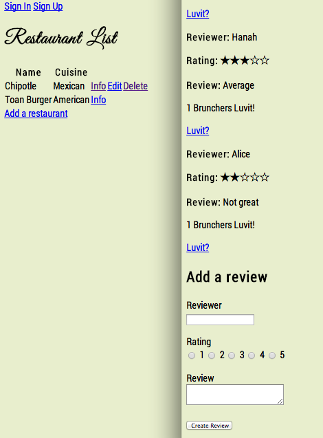

BrunchTime
==========

Week 8 Project at Makers Academy to create a restaurant review website, using Ruby on Rails for the first time.


Screenshot:



###Specification

+ Users can sign up/in/out
+ Users can leave reviews for restaurants
+ Users can 'like' reviews

###Technologies used

+ Ruby 
+ Rails
+ HTML
+ CSS
+ RSPEC
+ Capybara
+ Ajax
+ JQuery
+ PSQL
+ Git
+ Devise


###How to set it up

```sh
git clone https://github.com/aitkenster/BrunchTime.git
cd BrunchTime
bundle install
```

###How to run it

```sh
cd BrunchTime
rails s
```

visit localhost:3000 in the browser to see the app.

###How to test it

```sh
cd BrunchTime
rspec
``` 

